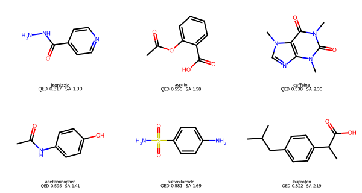
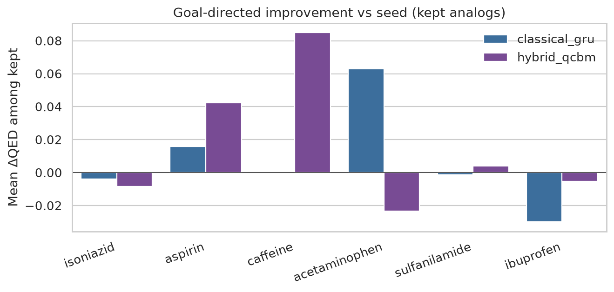
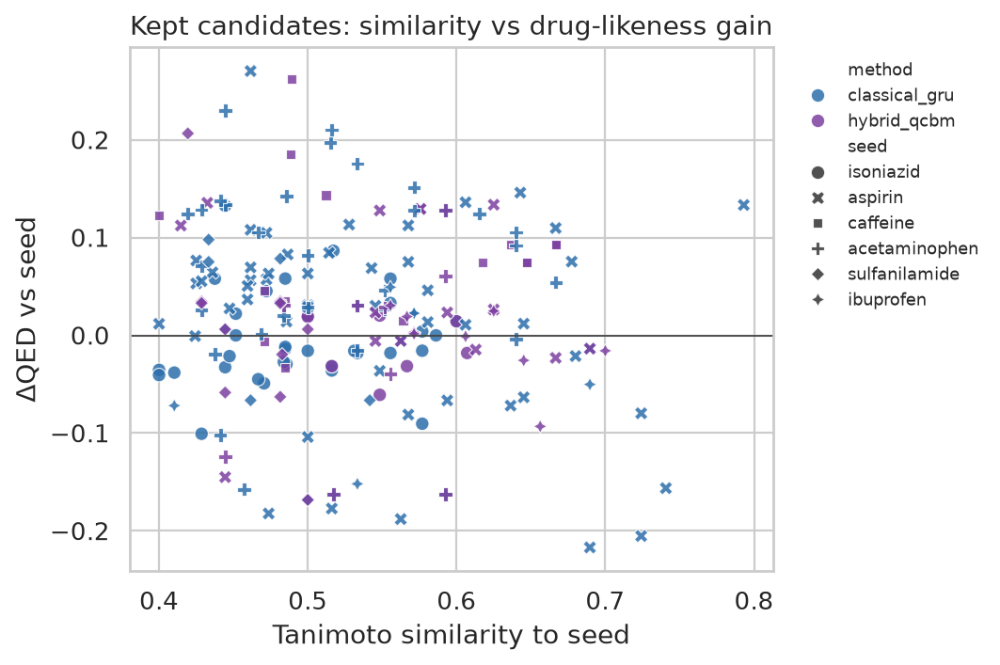
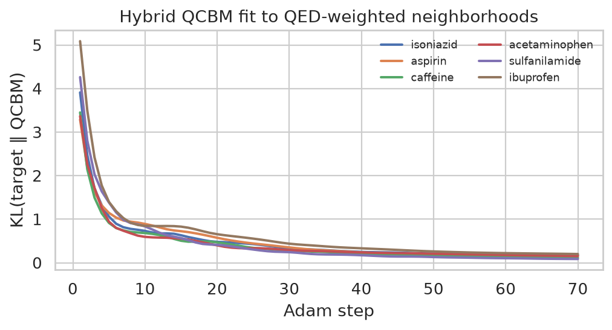

# Goal-directed molecule generation: classical GRU vs hybrid QCBM

A **portfolio bake-off**, not a claim that quantum computers now design drugs.

Given a public seed molecule (SMILES), both methods propose a fixed budget of candidates. We keep chemically valid, **novel** structures that stay in a Morgan-fingerprint neighborhood of the seed, then ask a simple question:

> Who finds analogs with **higher QED** (drug-likeness) than the seed?

Same seeds. Same candidate budget. Same similarity threshold. Same metrics.

---

## Why this problem

Early generative chemistry papers often report *unconditional* validity / uniqueness / novelty. That is necessary, but it is not how medicinal chemistry works. Chemists start from a hit or a known drug and hunt **close analogs that improve a property**.

This repo treats that loop as the unit of evaluation:

1. Generate *N* candidates (fixed attempt budget)
2. Keep RDKit-valid structures
3. Filter by Tanimoto similarity to the seed (Morgan radius 2, 2048 bits, threshold 0.40)
4. Prefer structures absent from the public reference set
5. Rank by **ΔQED vs seed**, and report Ertl SA scores

The objective is deliberately cheap and public (QED). It is a stand-in for a real assay, not a substitute for ADMET, docking, or synthesis planning.

---

## Methods

### Classical baseline — SELFIES-token GRU

A 2-layer GRU language model trained on a public drug SMILES corpus encoded as **SELFIES** (Krenn et al., *Machine-independent quantum chemistry / robust molecular string representation*, 2020). SELFIES is used so the neural baseline is not punished for SMILES syntax errors; almost every sample decodes to a valid graph.

Goal-directedness is classical and explicit:

- Pretrain on the reference corpus (with SMILES randomization)
- **Fine-tune** on the seed’s nearest neighbors plus a tiny enumerated analog cloud
- Sample with **seed-prefix conditioning** (lock 50–93% of the seed SELFIES, complete the rest)

### Hybrid quantum-classical — 6-qubit QCBM + analog decode

A **quantum circuit Born machine** (6-qubit parameterized `Rot` + ring-`CNOT` layers in PennyLane `default.qubit`) models a 6-bit latent distribution over the seed neighborhood:

1. Compress 2048-bit Morgan fingerprints of the public library with PCA → 6 bits
2. Reweight the empirical bitstrings of the seed’s top-40 neighbors by QED (and similarity)
3. Train the 6-qubit QCBM by KL(*target* ‖ *Born machine*)
4. Sample bitstrings from \(p_\theta(x) = |\langle x|\psi_\theta\rangle|^2\)
5. Decode: pick a parent (seed or Hamming-nearest neighbor) and apply a **bitstring-conditioned analog mutation** (methylation, halogenation, C↔N aromatic swap, acid→amide, …)

The quantum piece is real: a shallow variational circuit on a statevector simulator. The chemistry piece is classical, as it must be — qubits do not output SMILES. **This is hybrid and simulator-scale (6 qubits, 4 layers).**

---

## Fair comparison protocol

| Knob | Value |
| --- | --- |
| Seeds | 6 public FDA-era drugs (isoniazid → ibuprofen) |
| Attempts per method per seed | 160 |
| Similarity | Morgan Tanimoto ≥ 0.40 |
| Objective | QED; SA reported |
| Novelty | canonical SMILES not in the reference corpus |
| Hardware story | CPU + PennyLane `default.qubit` (no QPU) |

Metrics (per seed, then macro-averaged):

- Validity %, uniqueness %, novelty %
- Count kept (valid, unique, similar, not the seed)
- Mean / max Tanimoto among kept
- Mean / max ΔQED, fraction with ΔQED > 0
- Mean SA among kept (lower is more synthesizable)

---

## Repository layout

```
data/                  public seeds + filtered reference SMILES (cited)
src/                   chemistry, GRU, QCBM, metrics, plots, protocol
notebooks/             pre-executed showcase notebook
figures/               PNG + CSV written by the notebook
requirements.txt       pinned versions
```

---

## How to run

```bash
python -m venv .venv
source .venv/bin/activate
pip install -r requirements.txt
# CPU torch is enough; a CUDA wheel also works
jupyter notebook notebooks/goal_directed_mol_gen_bakeoff.ipynb
```

Or re-run the bake-off headlessly from the repo root:

```bash
PYTHONPATH=. python -c "from src.protocol import run_bakeoff; run_bakeoff()"
```

Wall-clock on a laptop / small VM: a few minutes (GRU pretrain dominates; the 6-qubit QCBM is cheap).

---

## Snapshot from the committed notebook

Locked protocol: 160 attempts / method / seed, Morgan Tanimoto ≥ 0.40, public ~1k-drug corpus.

| Method | Validity | Uniqueness | Novelty | Mean kept / seed | Mean Tc (kept) | Mean ΔQED (kept) | Frac. improved |
| --- | ---: | ---: | ---: | ---: | ---: | ---: | ---: |
| Classical SELFIES-GRU | 100% | 0.62 | 0.61 | 22.2 | 0.52 | +0.009 | 0.59 |
| Hybrid 6-qubit QCBM | 100% | 0.36 | 0.35 | 11.3 | 0.55 | +0.016 | 0.63 |

Both generators are chemically valid (SELFIES decode vs constrained analog decode). The GRU explores more unique strings; the QCBM stays slightly closer to the seed and shows a higher fraction of QED wins among kept analogs. **Caffeine is the tell:** the GRU keep-set is empty (prefix completion left the xanthine neighborhood), while the QCBM still returns local analogs. Ibuprofen (already QED 0.82) is a ceiling check — mean ΔQED goes slightly negative for both.

<p align="center">
  
</p>
<p align="center">
  
</p>
<p align="center">
  
</p>
<p align="center">
  
</p>

Full molecule grids, the QCBM circuit drawing, and per-seed tables live in `notebooks/goal_directed_mol_gen_bakeoff.ipynb` (pre-executed) and `figures/`.

---

## Data

Reference structures are a **size-filtered public subset** of [`HIPS/molecule-autoencoder`](https://github.com/HIPS/molecule-autoencoder) `data/all_drugs.smi` — documented small-molecule drugs, not a proprietary screening deck. Seeds are six widely published FDA-era structures taken from that same list. See `data/README.md`.

---

## Stack

RDKit · NumPy · pandas · scikit-learn · PyTorch · SELFIES · PennyLane (`default.qubit`) · Matplotlib / seaborn · Jupyter

---

## Honest limitations

- **Simulator, not a QPU.** Six qubits fit in a laptop statevector. Nothing here demonstrates quantum advantage.
- **Tiny corpus, tiny models.** ~1k public drugs and a 96-wide GRU are teaching-scale, not MolGPT / REINVENT / diffusion chemistry.
- **QED is not efficacy.** Improving QED can move *away* from a true bioactivity neighborhood. SA is a heuristic.
- **Decode mismatch.** The hybrid method is a local analog sampler; the GRU is a chemical language model with prefix locking. The protocol equalizes *budget and filters*, not inductive bias.
- **Sparse public neighborhoods.** FDA-like lists are structurally diverse; Tanimoto ≥ 0.4 is a strict keep-set on this corpus.
- **No docking, no ADMET panels, no retrosynthesis, no wet lab.**

If you want a stronger follow-up: swap QED for an oracle you trust, scale the corpus, and keep the same protocol. The value of this repo is the **head-to-head loop**, not a leaderboard claim.

---

## License / use

Code in this repository is for research demonstration. Drug structures are public. Do not treat generated molecules as safe, legal, or therapeutically meaningful candidates.
